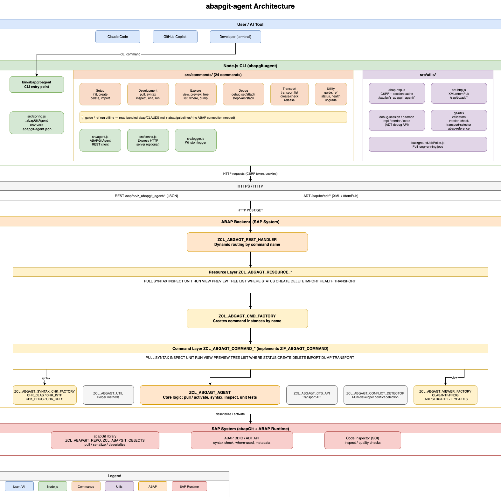

# Architecture Documentation

Internal architecture and design documents for developers and maintainers.

## System Architecture Diagram

The diagram below shows the full project architecture — from the CLI layer through to the ABAP backend and SAP system.

## Background Job Infrastructure

| Document | Description |
|----------|-------------|
| [background-job-architecture.md](background-job-architecture.md) | Complete guide to the background job infrastructure enabling asynchronous command execution with real-time progress reporting |

## Overview

The background job infrastructure enables asynchronous execution of long-running commands (e.g., `import`) without HTTP timeouts. It uses a polling pattern where:

1. Client sends POST request
2. Server determines if command should run in background (via decision engine)
3. For background execution: Server schedules job, returns HTTP 202 Accepted with job ID
4. Client polls GET endpoint for status updates
5. Job completes and returns final result

This architecture supports:
- ✅ Automatic detection via `zif_abgagt_progressable` interface
- ✅ Commands that take minutes to complete
- ✅ Real-time progress reporting via events
- ✅ Graceful handling of large packages (thousands of objects)
- ✅ No HTTP timeouts
- ✅ Generic infrastructure - single executor for all async commands

## For User Documentation

User-facing documentation for commands is in the parent `docs/` directory:
- [docs/import-command.md](../import-command.md) - Import command user guide
- [API.md](../../API.md) - REST API reference with async endpoints

These architecture documents are for internal reference only and should not be published to the user-facing website.
